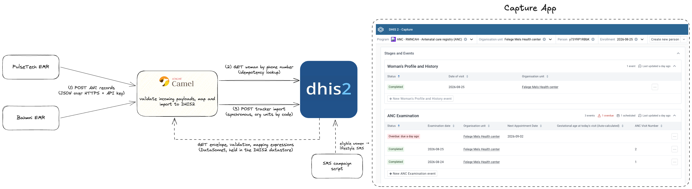

# EMR to DHIS2 ANC Integration - Reference Implementation

1. [What is this implementation?](#what-is-this-implementation)
2. [Quick Start](#quick-start)
3. [Overview](#overview)
   + [EMRs (PulseTech and Bahmni)](#emrs-pulsetech-and-bahmni)
   + [Mediator](#mediator)
   + [DHIS2](#dhis2)
   + [SMS campaign script](#sms-campaign-script)
4. [Error contract](#error-contract)
5. [Testing](#testing)
6. [Security Considerations](#security-considerations)
7. [Support](#support)

## What is this implementation?

Antenatal care (ANC) visits are recorded in electronic medical record systems
(EMRs) at the health facilities. For the ENABLE project, the same visits also
need to exist in the DHIS2 ANC tracker, because the tracker is what drives an
SMS programme that sends lifestyle messages and appointment reminders to
pregnant women. Entering every visit twice is not realistic, so this
reference implementation demonstrates how EMRs can push their visit data to
DHIS2 automatically.

Two EMRs participate: PulseTech and [Bahmni](https://www.bahmni.org/). Each pushes its own native JSON
export over HTTPS to a small mediator built with [Apache Camel](https://camel.apache.org/). The mediator
authenticates the sending site, validates the record, maps it to a DHIS2
tracker payload, and imports it. Imports are idempotent: the mediator looks
the woman up by her phone number before every import and
updates her if she already exists, so an EMR can safely push its full export
on a regular basis. DHIS2 generates and owns all identifiers.

All logic that is specific to one EMR, meaning its validation rules, its
field mappings and how its batch export is grouped into per-woman records,
lives as [DataSonnet expressions](https://datasonnet.github.io/datasonnet-mapper/datasonnet/latest/index.html) in the DHIS2 datastore. Adapting the
integration to a contract change, or onboarding a further EMR, is therefore
a configuration change rather than a code change.

While being tailored to a specific country use-case, this example can also guide your own EMR-DHIS2 integration. It should, however, not be
used directly in production without adapting it to your local context.

## Quick Start

The included Docker Compose configuration runs the self-contained example.
This includes DHIS2 loaded with the ENABLE ANC database, the mediator, and a seed container
that writes the DataSonnet expressions into the DHIS2 datastore.

Prerequisites:

* Docker Desktop
* Node.js 18+ with Yarn
* JDK 17+ and Maven

Then walk through the following steps:

1. Copy `.env.example` to `.env` and set the two API keys
   (`MEDIATOR_API_KEY_PULSETECH` and `MEDIATOR_API_KEY_BAHMNI`, for example
   generated with `openssl rand -hex 32`).
2. Run `yarn install && yarn build` to build the mediator.
3. Run `yarn start` to bring up the stack. The first boot takes a few
   minutes while DHIS2 loads the database dump. `yarn health` returns
   `{"status":"OK"}` once the mediator is ready.
4. To push the reference Bahmni export (8 encounters describing 5 women), run:

   ```sh
   yarn push:bahmni-batch
   ```

5. Open the Capture app at `http://localhost:8080` (username `admin`,
   password `district`). Select the organisation unit
   `Felege Meles Health center` and the programme
   `ANC - RMNCAH - Antenatal care registry`. The five women from the export
   are registered, each with a completed profile, completed examination
   events, and one scheduled event for her next appointment.
6. Run `yarn push:bahmni-batch` a second time. The response reports updates
   instead of creates, and nothing in Capture is duplicated.

`yarn push:pulsetech` and `yarn push:bahmni` push single-woman samples the
same way. To push with curl instead (the demo mediator uses a self-signed
certificate, hence `-k`):

```sh
curl -k -X POST https://localhost:9070/api/bahmni/anc-records \
  -H "X-API-KEY: $MEDIATOR_API_KEY_BAHMNI" -H "Content-Type: application/json" \
  -d @emr-mocks/bahmni/anc-records-batch.json
```

## Overview



The flow is accomplished in a few steps:

1. An EMR posts its export to the mediator, either one woman at a time
   (`POST /api/{source}/anc-record`) or as a batch
   (`POST /api/{source}/anc-records`). Each site authenticates with its own
   API key.
2. For a batch, the mediator first applies the source's envelope expression,
   which folds the raw export into one record per woman. Bahmni, for
   example, exports a flat list of encounters with several rows per woman.
3. Each record is validated against the source's validation rules. An
   invalid record is rejected with a readable message that names the missing
   fields and the patient concerned, so the EMR implementer can easily address the issues without reading the complete mediator logs.
4. The valid record is mapped to a DHIS2 tracker payload. Facility org units
   are passed through as codes and resolved by DHIS2 at import.
5. The mediator asks DHIS2 whether a woman with this record's phone number already
   exists in the programme. If she does, her existing identifiers are merged
   into the payload so the import updates instead of duplicating.
6. The payload is imported synchronously through the DHIS2 tracker API, and
   the import report is returned to the EMR.

The envelope, validation and mapping expressions are fetched from the DHIS2
datastore on each request. Editing them in the datastore changes the
mediator's behaviour without a redeployment.

### EMRs (PulseTech and Bahmni)

Each EMR exports the visits recorded at its facility as JSON in its own
native structure. The mediator does not require a common format; the
per-source expressions absorb the differences. The samples in
[`emr-mocks/`](emr-mocks) document both contracts, and
`emr-mocks/bahmni/anc-records-batch.json` is a reference export Batch from Bahmni. Key contract points, such as the mandatory phone number and
the fields required with the first visit, are documented in
[`docs/REFERENCE.md`](docs/REFERENCE.md).

A source exists when its API key is configured in `.env`. Onboarding a new
EMR means generating a key and writing three datastore expressions.

### Mediator

The mediator is a stateless Apache Camel application on [Spring Boot](https://spring.io/projects/spring-boot). Its
source code is located in the `mediator` directory. Per site, an API key,
a request size cap and a throttle guard the mediator endpoint. The per-record
pipeline is a single Camel route shared by the single-record and batch
endpoints; in a batch, every record runs the pipeline independently, so one
bad record never sinks the file.

Per source, three DataSonnet expressions drive the pipeline. Their readable
sources live in [`config/datastore/`](config/datastore) and can be packed from the reference implementation by running `yarn mappings:pack`:

| Datastore key | Input | Output |
|---|---|---|
| `enable-emr-envelope/<source>` | the raw batch body | a list of per-woman records |
| `enable-emr-validation/<source>` | one record | `{valid, missingFields, mrn}` |
| `enable-emr-mapping/<source>` | one record | the DHIS2 tracker payload |

### DHIS2

DHIS2 hosts the ANC tracker programme. The
database dump in [`db-dump/`](db-dump) carries the ENABLE metadata package
and the metadata state the contracts assume (see
[`db-dump/README.md`](db-dump/README.md)).

Visits that were captured in an EMR import as completed events, dated the
day they happened. The next appointment, taken from the latest visit, is
imported as one scheduled event, which the Capture app and any overdue
logic treat like an appointment a health worker scheduled within DHIS2.
When the woman attends, the next push updates that scheduled event into the
real visit. Program rules are skipped during imports; they continue to run
for humans in the Capture UI. The field mappings, identifiers and
idempotency mechanics are documented in
[`docs/REFERENCE.md`](docs/REFERENCE.md).

### SMS campaign script

The SMS programme is a separate script that reads eligible women from the
tracker and sends lifestyle messages through the DHIS2 SMS gateway. It is
not part of this repository, but can be found [here](https://github.com/dev-otta/fhi-enable-sms)

## Error contract

| Code | Meaning |
|---|---|
| 400 | invalid record. `missingFields` names what is missing and `patient` names the MRN concerned |
| 401 / 403 | missing key, unknown key, or a key used against another site's endpoint |
| 409 | DHIS2 rejected the import; DHIS2's own import report is passed through |
| 413 / 429 | request too large / too many requests (safe to retry, imports are idempotent) |
| 207 | batch with mixed outcomes; per-record statuses in `results[]` |
| 502 | DHIS2 unreachable or failing |

## Testing

The test suite has three layers. The fast layer runs the unit tests and is not reliant on
Docker. These tests check the mapping based on reference payloads, security and fault
injection. The integration layer boots a real DHIS2 from the dump with
Testcontainers and proves the actual import semantics, such as idempotent
re-pushes and the scheduled event becoming the visit. The end-to-end layer
drives the running Compose stack the way an EMR would.

```sh
yarn test-mediator               # unit and route tests (WireMock as DHIS2)
yarn test-mediator:it            # integration tests against a real DHIS2 (Docker required)
yarn test:e2e                    # Playwright suite against the running stack
yarn test:e2e:wipe               # same as above, then deletes the women the suite created
```

## Security Considerations

* Each site pushes with its own API key, and a key only works against its
  own site's endpoint. Keys should be generated with sufficient entropy and
  exchanged out of band.
* The demo mediator terminates TLS with a self-signed certificate. A real
  deployment should mount a proper keystore or terminate TLS in a reverse
  proxy.
* The mediator's DHIS2 account should be a least-privilege service account
  with capture access limited to the participating org units, not a
  superuser.
* The payloads contain personal data such as phone numbers and dates of
  birth. Request bodies and import reports are logged at DEBUG level only,
  and a privacy impact assessment should be carried out before connecting
  real facilities.

# Support

Questions or feedback are welcome. Please reach out to me at johan@devotta.no. Contributions
in the form of pull requests are also welcome.
